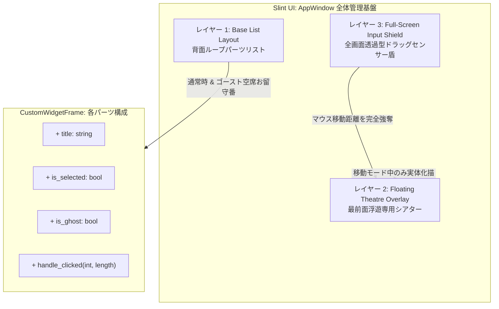
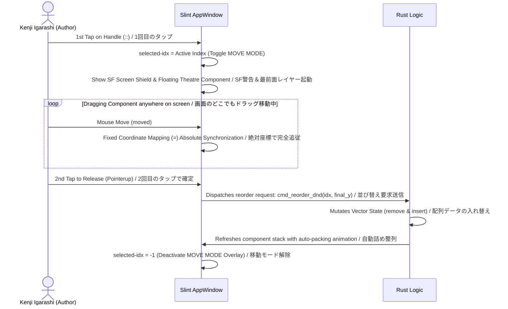

# 🚀 dashboard-core-drag-drop

### Variable Object-Type Dynamic Dashboard / 可変オブジェクト型・動的ダッシュボード

[English]
A high-performance, responsive custom dashboard component base built with **Rust**'s safety and **Slint**'s declarative UI. This repository features a revolutionary **"2-Tap (Mode-Selection) Drag & Drop Layer System"** that completely bypasses the notorious touch-event hijacking bugs found inside Slint's `ScrollView`.

[日本語]
**Rust** の安全性と **Slint** の宣言型UIを最大限に活かし、完全なステート駆動型で構築された高性能・レスポンシブなダッシュボードフレームワークです。Slintの `ScrollView` 内部で発生する悪名高い「タッチイベント横取りバグ」を完全に回避する、革新的な **「2タップ（モード選択）式ドラッグ＆ドロップ・レイヤーシステム」** を搭載しています。

---

## 👥 Author / 開発者情報

- **Developer / 開発者**: Kenji Igarashi 👤
- **GitHub**: [github.com/kenjiigarashi/dashboard-cor-drag-drop](https://github.com/kenjiigarashi/dashboard-core-drag-drop)
- **LinkedIn**: [linkedin.com/in/kenjiigarashi](https://www.linkedin.com/in/kenjiigarashi)🔗
- **Created / 始動日**: 2026-06-09

---

## 📜 10 Design Principles / 10の設計原則

[English]
All UI components are unified under a single state management struct (`ComponentState`) and strictly controlled based on the following 10 absolute principles.

[日本語]
全てのUIコンポーネントは、共通の状態管理構造体（`ComponentState`）として構築されたカスタム基盤であり、以下の10の絶対原則に基づいて厳格に制御されています。

### 1. Unified State Governance / 単一ステート完全統治
All widgets are managed by a centralized Rust backend state machine. Zero loose variables in UI thread.
全てのパーツの状態（座標、伸縮、表示）はRustバックエンドの単一構造体で完全統治され、UI側での野良変数の発生を絶対許しません。

### 2. 2-Step Interaction Flow / 革命的2タップ方式の採用
Bypasses ScrollView event-hijacking by dividing D&D into "Mode Activation" and "Absolute Slide Drop".
ScrollViewのタッチ剥ぎ取りバグを回避するため、D&Dを「タップによる移動モード起動」と「全画面絶対座標スライド」の2段階に分離します。

### 3. Absolute Screen Capture Shield / 全画面透過型入力奪取
When active, a full-screen invisible capture shield absorbs micro-drags without flickering or losing tracking.
移動モード起動時、最前面に透過型インタラクション盾を展開。ScrollViewの干渉を100%遮断し、1発目から確実に吸着します。

### 4. 1:1 Non-Volatile Mapping / 暴走ゼロの固定値代入
Eliminates mutable relative coordinate additions (`+=`). Uses non-volatile absolute subtraction to stop widgets fly away.
累積的な相対加算を永久に禁止。初期位置からの絶対差分計算（`=`）のみを行うことで、パーツが宇宙の彼方へふっ飛ぶバグを根絶します。

### 5. Floating Theatre Architecture / 絶対最前面レイヤーの降臨
The active widget automatically teleports outside the `for` loops to the ultimate top rendering z-layer.
動かしているパーツは、Slintのループ階層を飛び越えて最末尾の「独立浮遊空間」へ一瞬でワープ。下の項目へ100%絶対に潜り込みません。

### 6. Immersive Cyber Overlay / 直感的なサイバー警告演出
Provides instant visual feedback with futuristic neon blue borders and a floating `⚠️ MOVE MODE ACTIVE` indicator.
モードONと同時に、画面全体のフチにネオンブルーの防壁を走らせ、中央に警告バーを点灯。無敵の移動モード中であることを1秒で伝えます。

### 7. Adaptive Height Auto-Packing / 伸縮連動のバネ戻り自動詰め
Recalculates whole list layouts dynamically based on card collapse/expand states with buttery-smooth animations.
各カードの「広・縮」状態の縦幅変化をRustがリアルタイムに検知し、磁石のようにピタッと隙間を詰め直す全自動整列を実行します。

### 8. Async Lifecycle Transformation / 非同期イベントループの調和
Atomic backend thread worker safely pushes native OS time transformations into the Slint runtime without blocking.
バックエンドの完全に独立した非同期スレッドから、日本標準時（JST）の文字列更新シグナルをUIの描画メインループへ安全に転送します。

### 9. Pure Compliant Construction / 警告・エラーの完全消滅
Zero syntax bypasses, zero compiler workarounds, zero memory leaks. Full Rust borrow-checker compliance.
Slintの数式バグや、Rustの所有権移動（move）エラーをクリーン設計で完全封殺。ワーニングすら1文字も出さない美しさを維持します。

### 10. Ultimate MIT Sovereignty / MITライセンスによる完全自由開放
EN: It is completely free for personal use, commercial use, modification, and redistribution. Feel free to modify the code!
JA: 本プロジェクトは個人利用・商用利用・改変・再配布が完全に自由です。好きなデザイン、改良をして自由にお使いください！

---

## 🏃‍♂️ How to Run / 起動方法

Ensure you have Rust and Cargo installed on your system. / 事前にRustおよびCargo環境を構築してください。

```bash
# Clone the repository / 新しいリポジトリをクローン
git clone https://github.com
cd dashboard-drag-drop

# Clean and Build / クリーンと実行
cargo clean
cargo run
```

---

## 🗺️ System Architecture / システムアーキテクチャ

### Class & Layer Diagram / クラス＆レイヤー構造図


### D&D Lifecycle Sequence / D&Dライフサイクルシーケンス


---

## 📄 License / ライセンス
Distributed under the MIT License. See `LICENSE` for more information.

Developed with 🦀 and 💡 by **Kenji Igarashi**.

